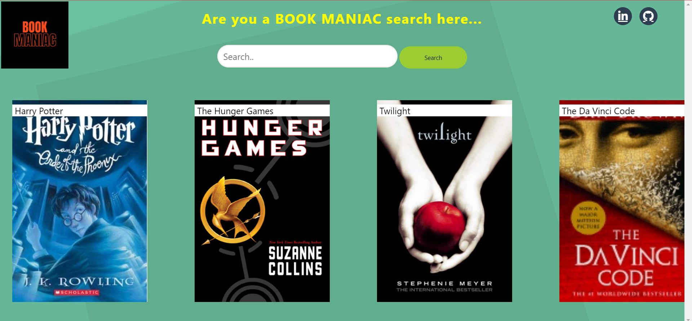

# Book Recommendation Web App

# Overview

Just enter one book name then it will recommend 10 books.

# Dataset used
I have used Goodreads 10000 books dataset.              
This dataset containd one csv files:
  1. dataset.csv

Link to dataset: https://www.kaggle.com/datasets/nguyenphd/goodreads-best-books-ever-with-recommendations

# Project lifecycle
* Cleaned the dataset
  * Dropped unimportant columns
  * Removed numbers and special characters
  * Removed stopwords
  * Extracted imoportant phrases
  * Combined all columns except movies name
* Creating Flask app
<!-- * Deployment of the application on Heroku -->

# Libraries used
* Pandas
* Numpy
* Matplotlib
* Json
* Rake_nltk
* Regular expression
* Sklearn
* Flask

# Some important algorithms used
* [RAKE (Rapid Automatic Keyword Extraction)](https://pypi.org/project/rake-nltk/):
  
  This algorithm is used to extract important phrases from the body of the text.
* Nearest Neighbours:
  
  I have used nearest neighbours algorithm to find the most related list of books to a book name. This algorithm takes argument named **'metric'**.I have assigned this argument to **'cosine'**. If two books are highly related then the cos value will be equal to 1 as angle between them will be 0 degree. If books are not related then angle between them will be 90 degree and value will equal to 0 (cos90=0).

  

## How to run the project?

1. Clone or download this repository to your local machine.
2. Install all the libraries mentioned in the [requirements.txt] file with the   command `pip install -r requirements.txt`.
3. Open your terminal/command prompt from your project directory and run the file `recommendation_app.py` by executing the command `python recommendation_app.py`.
5. Go to your browser and type `http://127.0.0.1:5000/` in the address bar.
6. Hurray! That's it.
   

<!-- # Directory tree
 -->

# Tool used
  

  